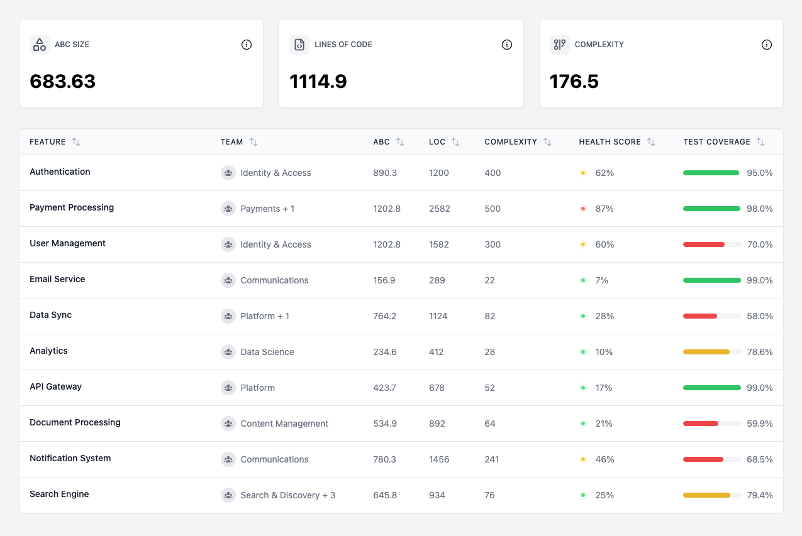
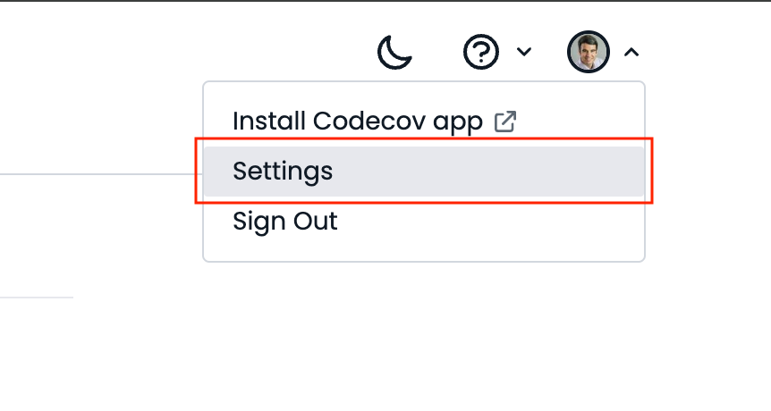
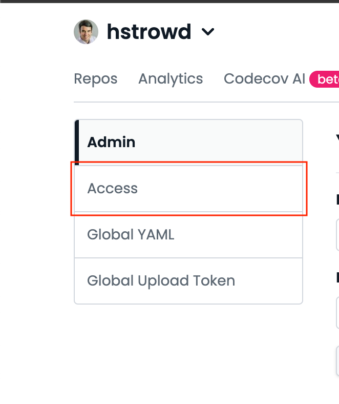
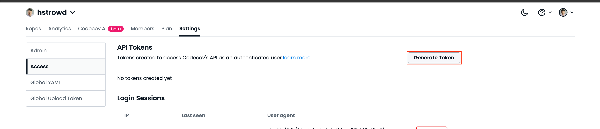
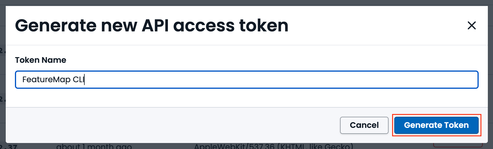
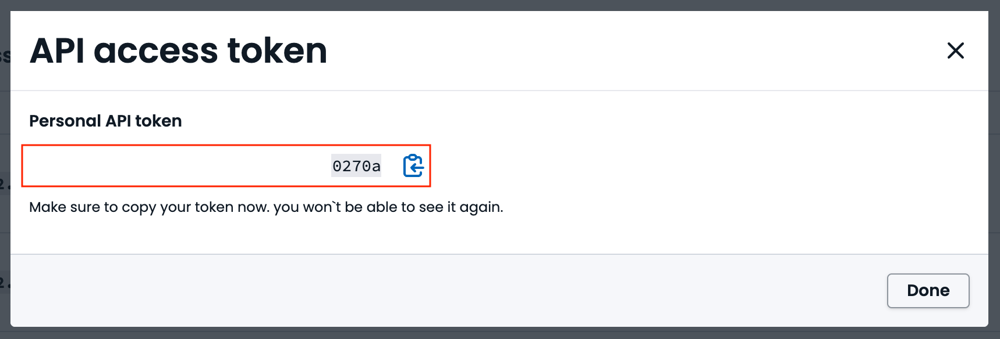

# FeatureMap

This gem helps identify and manage features within large Ruby and Rails applications. This gem works best in large, usually monolithic code bases for applications that incorporate a wide range of features with various dependencies.

## Getting started

To get started there's a few things you should do.

1) Create a `.feature_map/config.yml` file and declare where your files live. Here's a sample to start with:
    ```yml
    assigned_globs:
      - '{app,components,config,frontend,lib,packs,spec}/**/*.{rb,rake,js,jsx,ts,tsx}'
    unassigned_globs:
      - db/**/*
      - app/services/some_file1.rb
      - app/services/some_file2.rb
      - frontend/javascripts/**/__generated__/**/*
    ```
    You may find a more comprehensive example in this repository's `.feature_map/config.yml`.

2) Define the features of our your application. There are two methods for defining features:
    * YAML Definitions: Each feature can be defined in a separate YAML file within the `.feature_map/definitions` directory. Here's an example, that would live at `.feature_map/definitions/onboarding.yml`:
        ```yml
        name: Onboarding
        description: Lorem ipsum dolor sit amet, consectetur adipiscing elit, sed do eiusmod tempor incididunt ut labore et dolore magna aliqua. Ut enim ad minim veniam, quis nostrud exercitation.
        documentation_link: https://www.notion.so/onboarding-feature-abcd1234
        ```
    * CSV Definitions: All features can be defined within a single CSV file located at `.feature_map/feature_definitions.csv`. Here's an example of what that file might look like:
        ```
        # Comment explaining the purpose of this file and how it should be managed.

        Name,Description,Documentation Link,Custom Attribute
        Onboarding,"Lorem ipsum dolor sit amet, consectetur adipiscing elit.",https://www.notion.so/onboarding-feature-abcd1234,Test 123
        User Management,"Sed do eiusmod tempor incididunt ut labore et dolore magna aliqua. Ut enim ad minim veniam, quis nostrud exercitation",,
        ``` 
3) Declare feature assignments. You can do this at a directory level or at a file level. All of the files within the `assigned_globs` you declared in step 1 will need to have a feature assigned (or be opted out via `unassigned_globs`). See the next section for more detail.
4) Run validations when you commit, and/or in CI. If you run validations in CI, ensure that if your `assignments.yml` file gets changed, that gets pushed to the PR. A `metrics.yml` file will also be generated but we recommend NOT commiting that file because it changes very frequently.

## Usage: Assigning Features

There are multiple ways to assign the feature for a source file using this gem.

### Directory-Based Assignment
Directory based assignment allows for all files in that directory and all its sub-directories to be assigned to a single feature. To define this, add a `.feature` file inside that directory with the name of the feature as the contents of that file.

### File-Annotation Based Assignment
File annotations are a last resort if there is no clear home for your code. File annotations go at the top of your file, and look like this:
```ruby
# @feature Onboarding
```

### Glob-Based Assignment
In the YML configuration of a feature, you can set `assigned_globs` to be a glob of files assigned to this feature. For example, in `onboarding.yml`:
```yml
name: Onboarding
assigned_globs:
  - app/services/stuff_for_onboarding/**/**
  - app/controllers/other_stuff_for_onboarding/**/**
```

### Feature Definition File Assignment
By default any feature definition YML files, located in the `.feature_map/definitions' directory, are assigned to their corresponding feature.

The leading `.` in the path for these files results in them being quoted within the resulting `.feature_map/assignments` file. The following is an example of this content:
```yml
---
files:
  ".feature_map/definitions/bar.yml":
    feature: Bar
    mapper: Feature definition file assignment
features:
  Bar:
  - ".feature_map/definitions/bar.yml"
```

In cases when the feature assignments for these files is irrelevant, this behavior can be disabled by setting the `ignore_feature_definitions` key in the `.feature_map/config.yml` file to `true`.

### Custom Assignment
To enable custom assignment, you can inject your own custom classes into `feature_map`.
To do this, first create a class that adheres to the `FeatureMap::Mapper` and/or `FeatureMap::Validator` interface.
Then, in `.feature_map/config.yml`, you can require that file:
```yml
require:
  - ./lib/my_extension.rb
```

Now, `bin/featuremap validate` will automatically include your new mapper and/or validator. See [`spec/lib/feature_map/private/extension_loader_spec.rb](spec/lib/feature_map/private/extension_loader_spec.rb) for an example of what this looks like.

## Usage: Reading FeatureMap

Check out [`lib/feature_map.rb`](https://github.com/Beyond-Finance/feature_map/blob/main/lib/feature_map.rb) to see the public API.

Check out [`feature_map_spec.rb`](https://github.com/Beyond-Finance/feature_map/blob/main/spec/lib/feature_map_spec.rb) to see examples of how the feature map utility is used.

### `for_file`
`FeatureMap.for_file`, given a relative path to a file returns a `CodeFeatures::Feature` if there is a feature assigned to the file, `nil` otherwise.

```ruby
FeatureMap.for_file('path/to/file/relative/to/application/root.rb')
```

Contributor note: If you are making updates to this method or the methods getting used here, please benchmark the performance of the new implementation against the current for both `for_files` and `for_file` (with 1, 100, 1000 files).

See `feature_map_spec.rb` for examples.

### `for_backtrace`
`FeatureMap.for_backtrace` can be given a backtrace and will either return `nil`, or a `CodeFeatures::Feature`.

```ruby
FeatureMap.for_backtrace(exception.backtrace)
```

This will go through the backtrace, and return the feature of the first files with a feature assignment associated with frames within the backtrace.

See `feature_map_spec.rb` for an example.

### `for_class`

`FeatureMap.for_class` can be given a class and will either return `nil`, or a `CodeFeatures::Feature`.

```ruby
FeatureMap.for_class(MyClass)
```

Under the hood, this finds the file where the class is defined and returns the featuer assigned to that file.

See `feature_map_spec.rb` for an example.

### `for_feature`
`FeatureMap.for_feature` can be used to generate a feature report for a single feature.
```ruby
FeatureMap.for_feature('Onboarding')
```

You can shovel this into a markdown file for easy viewing using the CLI:
```
bin/feature_map for_feature 'Onboarding' > tmp/onboarding_feature_report.md
```

## Usage: Generating Feature Assignment files

When you run `bin/featuremap validate`, the following files will automatically be generated:
 * `.feature_map/assignments.yml`: Captures a mapping of files within a repository to their corresponding feature and a mapping of features to their corresponding files.
 * `.feature_map/metrics.yml`: Captures a set of metrics rolled up at the feature level (i.e. computed over all files assigned to the feature).

## Usage: Generating Documentation

The feature map gem captures valuable insights about the features of your application (e.g. metrics like ABC size, lines of code, and cyclomatic complexity). To review this information locally, you can run `bin/featuremap docs` to produce a single, self contained HTML file that includes a fully functional documentation site with useful diagrams and details about the features of your application. This file is created within the `.feature_map/docs` directory and the `index.html` file can loaded in the browser of your choice by running `open .feature_map/docs/index.html`.

**Example screenshot**


## Usage: Collecting Test Coverage

When you run `bin/featuremap test_coverage`, the test coverage statistics the latest commit on the main branch will be pulled from [CodeCov](https://codecov.io/) and collected into a set of per-feature test coverage statistics. This feature level test coverage data is then captured in the `.feature_map/test-coverage.yml` file.

This command requires the following CodeCov account settings to be configured within the `.feature_map/config.yml` file:

```yml
code_cov:
  service: github
  owner: Acme-Org
  repo: sample_app
```

See the [CodeCov API docs](https://docs.codecov.com/reference/repos_retrieve) for more information about the expected values for these configurations.

Test coverage statistics can be pulled for a specific commit (e.g. the latest commit on a feature branch) by including the full commit SHA as an argument at the end of this CLI command (e.g. `bin/featuremap test_coverage ae80a927654997be4f48d3dbcd1320083cf22eea`). Before running this command please check the [CodeCov dashboard](https://app.codecov.io/) for your application to ensure test coverage statistics have been reported for this commit.

### CodeCov API Token Generation

Running the `bin/featuremap test_coverage` requires an active CodeCov API access token to be specified in the `CODECOV_API_TOKEN` environment variable of your shell session. This token is used to retrieve coverage statistics from the CodeCov account configured in the `.feature_map/config.yml` file.

Use the following steps to generate a new CodeCov API token:

1. Log into your [CodeCov account](https://app.codecov.io/)
1. Click the "Settings" menu option in the profile dropdown menu in the top right corner of the screen
    
1. Click the "Access" menu option from the left-hand navigation menu of the Settings page
    
1. Click the "Generate Token" button in the "API Tokens" section of the page
    
1. Enter a descriptive name for the token (e.g. FeatureMap CLI) and click the "Generate Token" button
    
1. __IMPORTANT__: Copy the access token value presented on the screen and store it in a secure location (e.g. 1Password entry, BitWarden entry, etc)
    

#### __OPTIONAL__:  Store the token as an environment variable in your shell's environment:
**ZSH**
  ```shell
  echo 'export CODECOV_API_TOKEN="YOUR_CODECOV_API_TOKEN"' >> ~/.zshrc
  source ~/.zshrc
  ```

**Bash**
  ```shell
  echo 'export CODECOV_API_TOKEN="YOUR_CODECOV_API_TOKEN"' >> ~/.bashrc
  source ~/.bashrc
  ```

## Proper Configuration & Validation

FeatureMap comes with a validation function to ensure the following things are true:

1) Only one mechanism is defining the feature assignment for a file. That is -- you can't have a file annotation on a file assigned via glob-based assignment. This helps make feature assignment behavior more clear by avoiding concerns about precedence.
2) All features referenced as an assignment for any file is a valid feature (i.e. it's in the list of `CodeFeatures.all`).
3) All files have a feature assigned. You can specify in `unassigned_globs` to represent a TODO list of files to add feature assignments to.
    * Teams using the [CodeOwnership](https://github.com/rubyatscale/code_ownership/tree/main) gem include a `require_assignment_for_teams` key in the `.feature_map/config.yml` file to have this validation to apply a specific list of team. This allows feature assignments to be rolled out in a gradual manner on a team-by-team basis. The `require_assignment_for_teams` configuration should contain a list of team names (i.e. the value from the `name` key in the associated `config/teams/*.yml` file) for the teams whose files will be included in this validation.
3) The `assignments.yml` file is up to date. This is automatically corrected and staged unless specified otherwise with `bin/featuremap validate --skip-autocorrect --skip-stage`. You can turn this validation off by setting `skip_features_validation: true` in `.feature_map/config.yml`.

FeatureMap also allows you to specify which globs and file extensions should be considered assignable.

Here is an example `.feature_map/config.yml`.
```yml
assigned_globs:
  - '{app,components,config,frontend,lib,packs,spec}/**/*.{rb,rake,js,jsx,ts,tsx}'
unassigned_globs:
  - db/**/*
  - app/services/some_file1.rb
  - app/services/some_file2.rb
  - frontend/javascripts/**/__generated__/**/*
```
You can call the validation function with the Ruby API
```ruby
FeatureMap.validate!
```
or the CLI
```
bin/featuremap validate
```

## Development

Contributions are welcome and appreciated. Here's how to get started:

- clone repo: `$ git clone git@github.com:Beyond-Finance/feature_map.git`
- install dependencies: `$ bundle install`
- run tests: `$ bundle exec rspec`
- run Rubocop: `$ bundle exec rubocop`
- run Sorbet: `$ bundle exec srb tc`

That's it! Assuming you can complete all of these steps without any error or issues, you should be good to go.

#### Publication

When a new version of the gem is ready to be published, please follow these steps:

* Create a new release tag in Github ([link](https://github.com/Beyond-Finance/feature_map/releases)).
    * Assign a version to this release in accordance with [Semantic Versioning](https://semver.org/) based on the changes contained in this release.
* Checkout the release tag in your local environment.
* Publish the new version of the gem to RubyGems ([docs](https://guides.rubygems.org/publishing/#publishing-to-rubygemsorg)).
